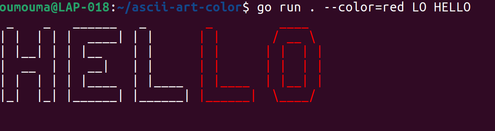
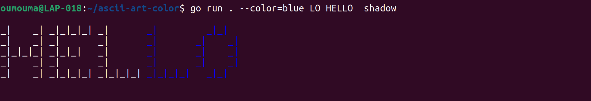
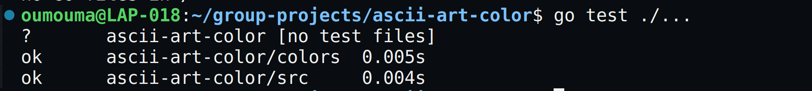

# ASCII ART COLOR
## Overview

This project provides a Go-based solution to generate ASCII art from input text, with the capability to apply colors to specific substrings within the text. The ASCII art representation is construction is constructed using predefined templates, and supports a variety of colors models. This tool can be particularly useful for creating visually appealing command-line ouputs or text for various applications.

## Features

- **Generate ASCII Art**: Convert plain text into stylized ASCII art.
- **Color Substrings**: Apply specific colors to substrings within the ASCII art.
- **Supports multiple color formats**: Named colors, Hex, and RGB colors.

- **Handles Non-ASCII Characters**: Ensures all input characters are valid ASCII.
- **Supports Different Banners**: Standard, Shadow, and Thinkertoy.

## Project Structure
```
.
├── main.go
├── colors
│   ├── convertcolors_test.go
│   ├── convertcolors.go
├── src
│   ├── banner_test.go
│   ├── banner.go
│   ├── func_test.go
│   ├── func.go
│   ├── asciiart_test.go
│   ├── asciiart.go
├── banners
│   ├── standard.txt
│   ├── shadow.txt
│   ├── thinkertoy.txt
├── go.mod
└── README.md
```

## Setup

### Prerequisites
- Go 1.18+ installed on your machine.
- Clone the repository:
```bash
git clone https://learn.zone01kisumu.ke/git/vmuhembe/ascii-art-color.git 
cd ascii-art-color
```
### Installing Dependancies
Run the following command to download the required Go modules:
```bash
go mod tidy
```

## Usage

### Command-Line 
```bash
Usage: go run . [OPTION] [STRING]

EX: go run . --color=<color> <substring to be colored> "something"
```
### Example

1. To generate ASCII art for the word "HELLO" and color the substring "LO" in red:


- By running the command in the example above, you are instructing the program to output the string **"HELLO"** with the substring **"LO"** in color ***red*** while the rest of the string uses the default color allocation, using the banner file **"standard"**, which acts as the default banner file when none is specified.
2. In case a banner file (e.g **shadow** or **thinkertoy** or **standard**) is specified, the generated equivalent ASCII-ART reprepresentaion will be displayed in the banner file style.



- Above is an example of a specified banner input i.e ., **shadow** and color specifed as blue:

### Color Input Styles
This preoject supports various color input styles for specifying the color of the text in the ASCII art .
The supported styles are:
1. **Named Colors**: Standard color names such us "red", "green", "blue", etc.
2. **Hexadecimal colors**: Hex codes representing colors, such as `FF0000` for red.
3. **RGB** Colors: RGB values representing colors, such as `rgb(255,0,0)` for red.

### Examples
Here are some examples of how to use these color input styles in your commands:

#### Using Named Colors
```sh
go run . --color=red "your text"
```

#### Using Hexadecimal Colors
```sh
go run . --color=#FF5733 "your text"
```
### Using RGB Colors
```sh
go run . --color=rgb(255,87,51) "your text"
```

- By providing support for these different color input styles, you can easily customize the appearance of your ASCII art with a wide range of colors.
## `Note`
- When using name colors input styles, the following are the supported colors for text colorization
    <table>
    <tr>
    <td>
    <ul>
    <li>black </li>   
    <li>orange </li> 
    <li>red         </li>  
    <li>green       </li>   
    <li>yellow      </li>   
    <li>blue        </li>   
    <li>magenta     </li>   
    <li>cyan        </li>   
    <li>white       </li>   
    <li>gray        </li>   
    <li>darkred     </li>   
    <li>darkgreen   </li>   
    <li>darkyellow  </li>   
    <li>darkblue    </li>   
    <li>darkmagenta </li>   
     <li>peru      </li> 
     </ul>
    </td>
    <td>
    <ul>  
    <li>lightgray   </li>   
    <li>lightred    </li> 
    <li>lightgreen  </li>   
    <li>lightyellow </li>   
    <li>lightblue   </li>   
    <li>lightmagenta</li>   
    <li>lightcyan   </li>  
    <li>pink        </li>
    <li>peach       </li>   
    <li>lavender    </li>   
    <li>turquoise   </li>   
    <li>violet      </li>  
    <li>gold        </li>   
    <li>silver      </li>   
    <li>maroon      </li> 
     </ul>
    </td>
    <td>
    <ul>   
    <li>olive       </li>  
    <li>navy         </li>
    <li>purple         </li>
    <li>teal           </li>
    <li>bisque         </li>
    <li>skyblue        </li>
    <li>salmon         </li>
    <li>khaki          </li>
    <li>orchid         </li>
    <li>thistle        </li>
    <li>tan           </li>
    <li>sienna         </li>
    <li>slategray      </li>
    <li>wheat          </li>
    <li>indigo         </li>
     </ul>
    </td>
    <td>
    <ul> 
    <li>burlywood      </li>
    <li>firebrick      </li>
    <li>cadetblue      </li>
    <li>darkorchid    </li>
    <li>darkslategray  </li>
    <li>darkgoldenrod  </li>
    <li>rosybrown </li>
    <li>mediumaquamarine</li>
    <li>darkseagreen   </li>
    <li>slateblue  </li>
    <li>mediumslateblue</li>
    <li>sandybrown     </li>
    <li>darkkhaki      </li>
    <li>palevioletred   </li>
    <li>mediumvioletred </li>    
     </ul>
    </td>
    </tr>
    </table>

## Running Test 
To run tests, use the following command:
```sh
go test ./...
```

### Test Results 
The tests results indicate that all tests in the `colors` and `src` packages ran successfully. 

- above is an example of what you'll see on the command-lind after runding the test comand:

## Contributing
- All contributions are welcome!If you find and issue or have suggestions for improvements, please open an issue or submit a pull request.
  - Fork the repository
  - Create your feature branch:
  ```sh
  git checkout -b <feature-name>
  ```
  - Commit your changes:
  ```sh
  git commit -am'Add feature'
  ```
  - Push to the branch
  ```sh
  git push origing <feature-name>
  ```
  - Open a pull request  

## Authors

 ### Fred Munene
 [](https://github.com/FredMunene)

### Valeria Muhembele
[](https://github.com/anamivale)

### Ouma Ouma 
[](https://github.com/garveyshah)


## License
This project is licensed under the MIT License, see the [LICENSE](LICENSE) file for details.